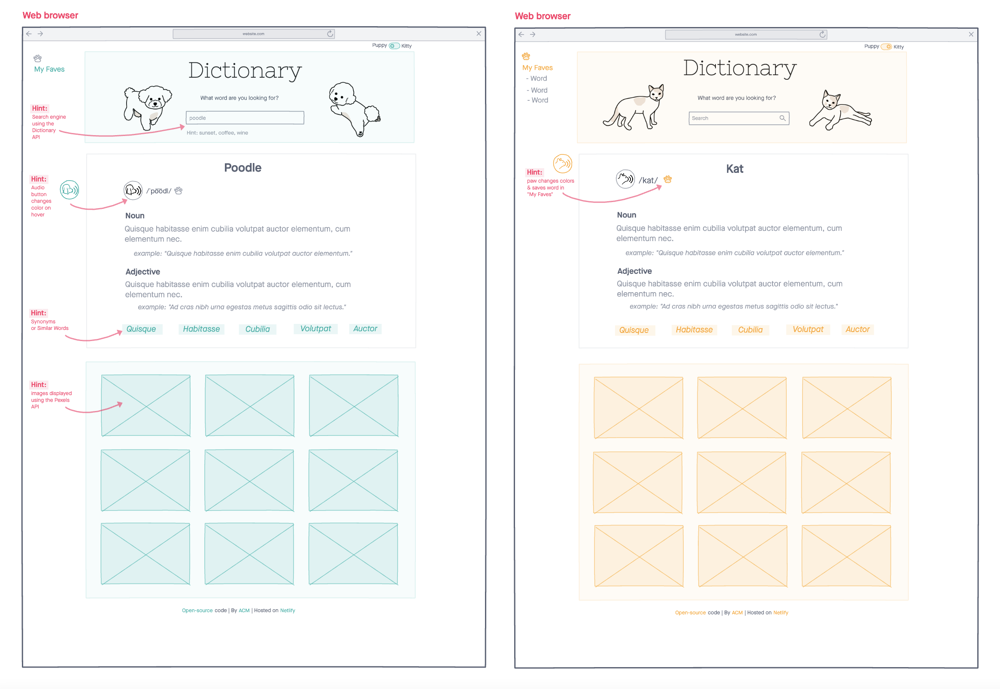
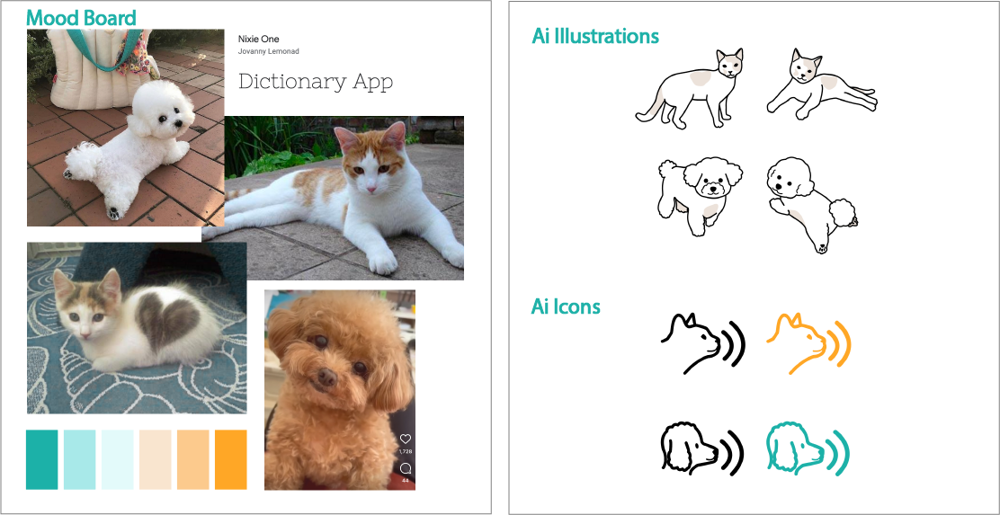

# React Dictionary

**React Dictionary** is a Front End Development project that explores the use of REST Api's in a dictionary app in which the user looks up a word and the app returns valuable information, such as:

- part of speech
- word definition
- examples
- synonyms
- word-related images

This project was created during the [SheCodes React Workshop](https://www.shecodes.io/).

## Wireframe

## Mood Board

## Built with

- [Axios](https://github.com/axios/axios)
- [Bootstrap](https://getbootstrap.com/)
- [Create React App](https://create-react-app.dev/)
- [Free Dictionary API](https://dictionaryapi.dev/)
- [Pexels API](https://www.pexels.com/api/documentation/)

## Project Status

Currently working to add a "kitty" mode and responsive images.

## Usage

Anyone is welcome to fork or clone this repository, as long as it is **not** for commercial use. Please replace the api key to your own api key.
